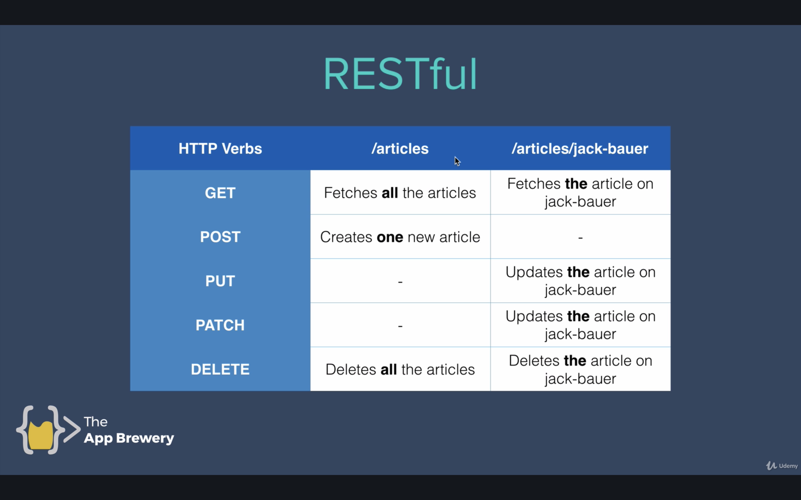
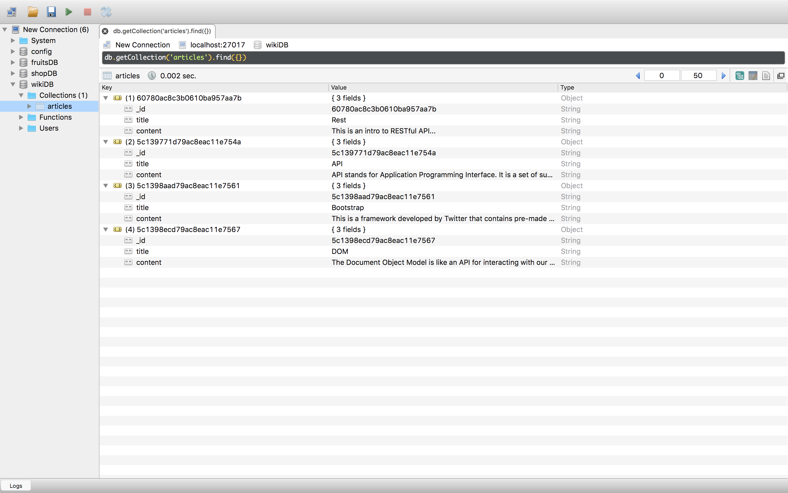
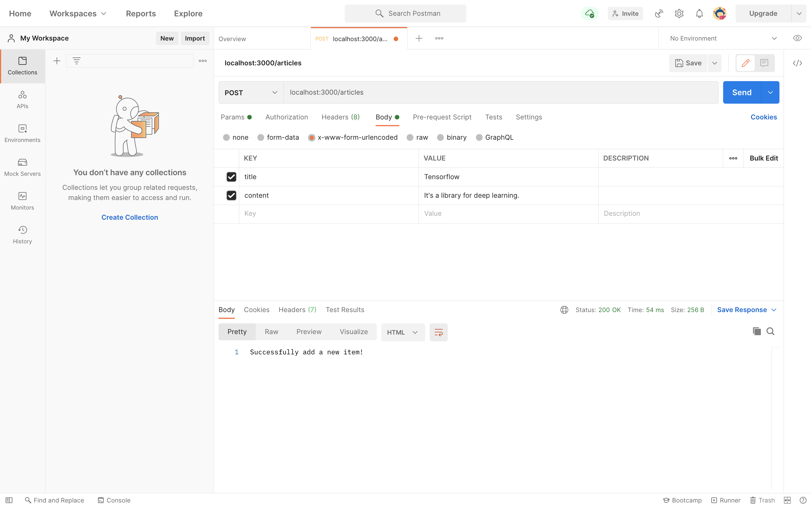
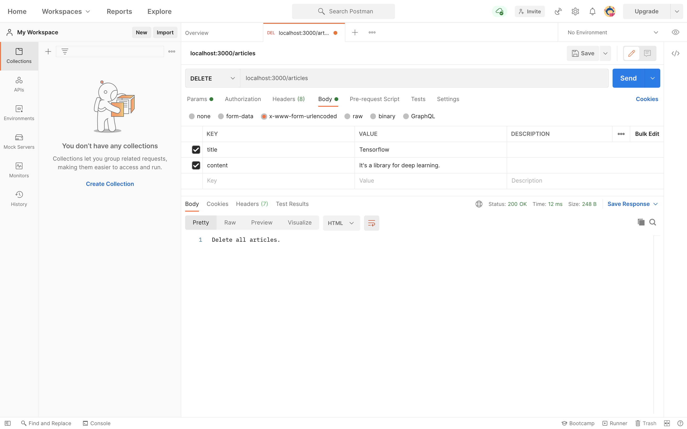

# Wiki-API

```shell
mkdir -p Wiki-API
cd Wiki-API

touch app.js
npm init -y
npm i body-parser express ejs mongoose
```

## Tools

1. Robo 3T
2. Postman

## RESTful Routing



## Data Template

```
{
    "_id":"60780ac8c3b0610ba957aa7b",
    "title":"Rest",
    "content":"This is an intro to RESTful API..."
}

{
    "_id":
    "5c139771d79ac8eac11e754a",
    "title":"API",
    "content":"API stands for Application Programming Interface. It is a set of subroutine definitions, communication protocols, and tools for building software. In general terms, it is a set of clearly defined methods of communication among various components. A good API makes it easier to develop a computer program by providing all the building blocks, which are then put together by the programmer."
}
    
{
    "_id":"5c1398aad79ac8eac11e7561",
    "title":"Bootstrap",
    "content":"This is a framework developed by Twitter that contains pre-made front-end templates for web design"
}

{
    "_id":"5c1398ecd79ac8eac11e7567",
    "title":"DOM",
    "content":"The Document Object Model is like an API for interacting with our HTML"
}
```

## Result Screenshots



